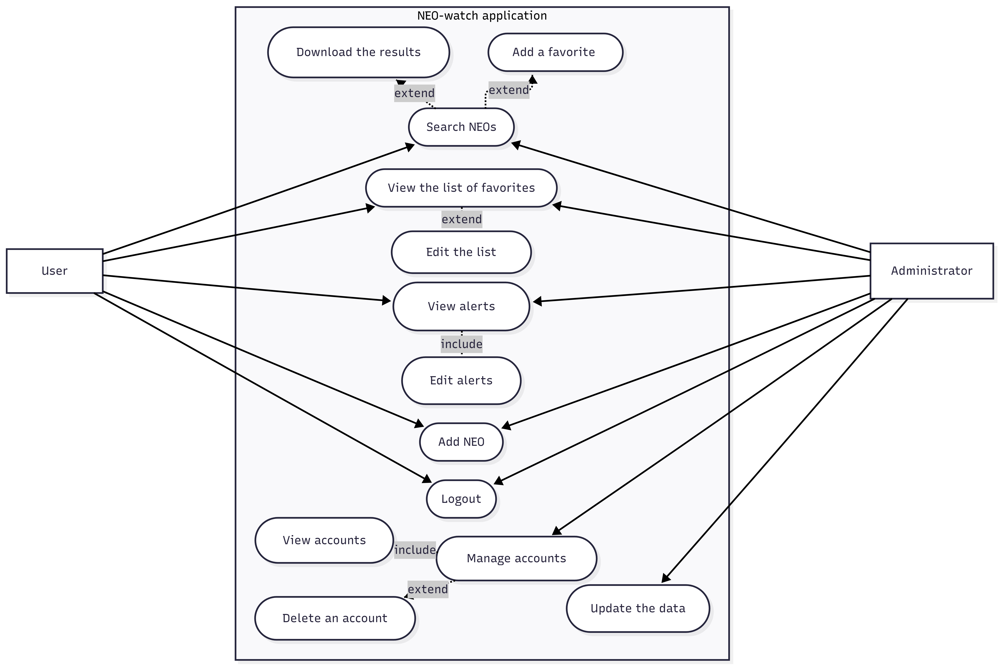
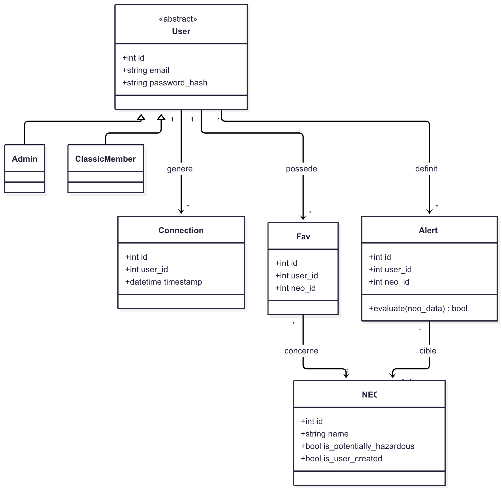
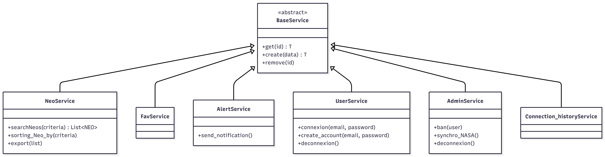
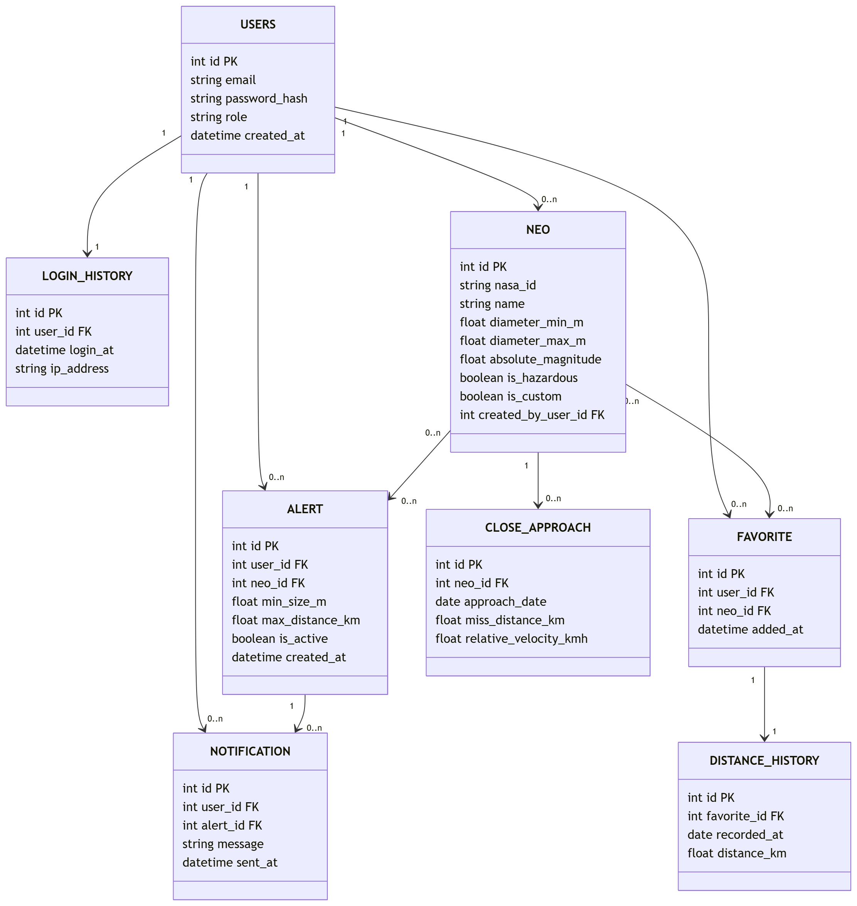
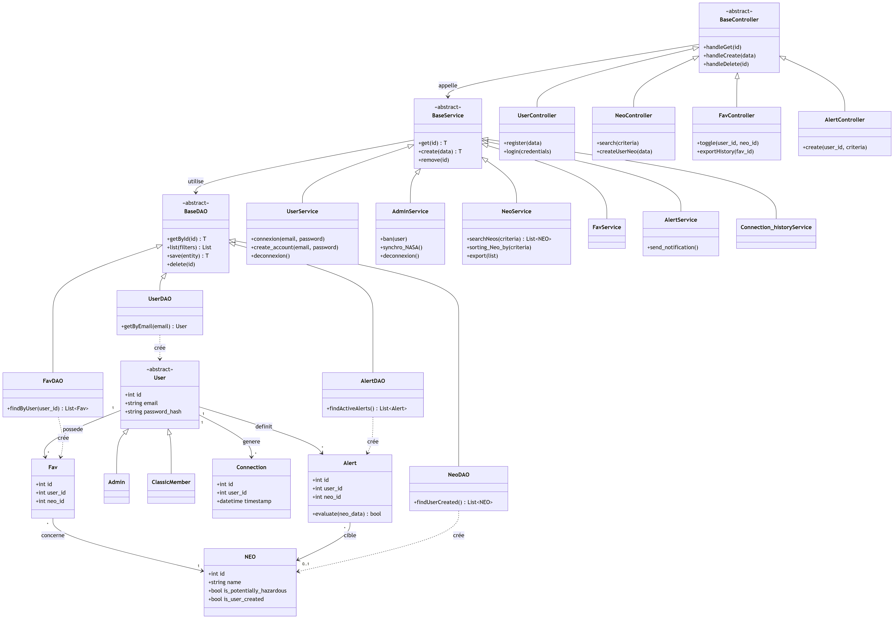

\begin{titlepage}
\centering

{\LARGE\textsc{Informatic project}}\\
\vspace{0.5cm}
{\large Studient 2nd year}

\vspace{2.5cm}

\rule{\textwidth}{0.5mm}\\
\vspace{0.8cm}
{\huge\bfseries Analysis report: NEO-Watch}\\
\vspace{0.8cm}
\rule{\textwidth}{0.5mm}\\

\vspace{2.5cm}

\begin{flushleft}
\emph{Students :}\\
Yann Malzieu\\
Faustine Barbeau\\
Jules Frulli\\
Abderrahmane Taleb Amar\\
\end{flushleft}

\begin{flushright}
\emph{Tutor :}\\
Olivier Ricciardi\\
\vspace{1.0cm}
\end{flushright}

\vfill 
\begin{center}
ENSAI\\
2026--2027
\end{center}
\end{titlepage}

\renewcommand{\contentsname}{Table of content}
\tableofcontents

# 1. Introduction and Context - A 

# 2. Requirements Analysis and Main Features

## 2.1 Functional Requirements

Before detailing the technical design, it is worth specifying the main functional requirements the application must meet. We focus here on four structuring aspects: user management, the dashboard, alerts, and the use of NASA's API.

**User and access management.** The application handles personalised data (favourites, alerts, history) specific to each person, so access must be secured and individualised. We distinguish two profiles for this purpose. The standard user has an account giving access to their personal space and to the viewing features. The administrator is a particular user with additional rights: they manage other users' accounts, view the connection history, and trigger data updates. This separation of roles meets a security need, since certain sensitive actions must only be accessible to an identified manager. Passwords are never stored in plain text, but in a protected form.

**Dashboard.** A user who logs in wants quick access to useful information, without having to perform a search every time. The application therefore offers a dashboard summarising the essentials upon login: the upcoming objects approaching Earth, the number of potentially hazardous objects among these approaches, or the closest object over a given period. This dashboard is partly personalised, notably by displaying the asteroids the user has marked as favourites, so that everyone finds the objects that interest them first.

**Alerts.** A user cannot continuously monitor the entire catalogue, so they need to be notified automatically when a relevant event occurs. The application therefore lets them define personalised alerts, expressing a condition of their choice (for example, being notified when an asteroid larger than a certain size passes within a certain distance of Earth). These alerts are evaluated when the user logs in: if an event matches one of their conditions, a notification is presented to them. This login-based approach avoids continuous monitoring while ensuring that the user is informed as soon as they return to the application.

**Use of NASA's API.** The data on near-Earth objects comes from NASA's public API. Rather than querying this API at each user action, the application keeps a copy of it in its own database, updated by the administrator. This choice ensures fast response times and limits the number of requests sent to NASA. It does, however, imply a particular requirement: the application must distinguish objects originating from NASA from those added by the users themselves, so that the latter are never overwritten during updates.
## 2.2 Use case diagram

The NEO-Watch app is available to users and administrators with a personal account. To start using the app, visitors can register or log in. Once this first step has been completed, the various features are shown in Figure ?.

Several features are available to users.

They can search for NEOs, then download the results or add a NEO to their favourites. The app also allows users to view their list of favourite NEOs, giving them the option to edit this list. To help users keep track of changes to NEOs, they receive notifications after login. Later, they can view previous alerts. To view alerts and receive notifications, users must configure them. They can choose the type of alerts.
As app users are likely to observe NEOs, they can discover new ones and add them to the app. Finally, users can log out of the app.

The administrator is a user with additional functions. They can update data relating to NEOs and manage the app’s accounts. This management function involves viewing the various accounts and allows them to delete accounts.

## 2.3. Application Workflow (Activity Diagram + Settings Activity Diagram). - Y

When the user is logging, he enter in the main application. We list all the features and also the settings part as show as in figure 3.

This figure focuses on the settings section. There are two different parts: one for the user and the other for the administrator. The administrator is also a user, so they can access both parts.

Users has a personal section where they can change the theme color, such as switching to dark mode or light mode.

They can also customize the dashboard, meaning they can choose which features they want to display on the dashboard page.

The administrator can use these features in their designated section. 

Additionally, when a user logs out, the application automatically redirects them to the home page.

# 3. Technical Design and Data Structure

### In introduction put here the technical characteristics - Y 

The application will be developed in Python and version-controlled via Git, to run a FastAPI backend coupled with a PostgreSQL database for reliable data persistence. It will dynamically integrate with NASA’s Near Earth Object Web Service (NeoWs) REST API using secure authentication keys. Code quality and system reliability will be ensured by comprehensive automated testing with pytest, while the frontend layer will be flexibly built using Python frameworks or standard web technologies.

## 3.1. Class Architecture (Class Diagram). 

To build our class diagram, we chose to have classes for each layer: the controller layer, the service layer, the DAO layer, and the business layer.

The global diagram is very large, and some parts of it are very simple and repetitive. The DAO classes contain only the basic functions (CRUD functions). The controller layer is, in our case, very simple — we use it only to check whether the user issuing a request has the permission to do so. Since these layers are not the most important, and in order to keep the diagram readable, we put them in the annex at the end of the document.

For the business layer, we decided to create a class for each important object in the project. A class User, which is abstract, is the parent of two different roles, Admin and ClassicMember, useful for handling different permissions later on. A class NEO is at the center of our project and stores all the information we need about them. Classes Alert, Fav (favorite NEOs), and Connection store information related to users.

For the services, we have a BaseService class containing the basic functions (CRUD) needed by all the other service classes. We then added one service class per business object created above, each with its own adapted functions.

## 3.2. Table Organization (Database Diagram).

For the data diagram, we reused the business objects created above and translated each class into a table, storing every attribute needed. Each table has a primary key (marked PK) and, when relevant, one or more foreign keys (marked FK) to represent relationships between tables.

Compared to the class diagram, the data diagram makes the multiplicities explicit through foreign keys: for instance, a foreign key user_id in the Alert, Fav, and Connection tables represents the "1" side of the relationship with User, since each of these records belongs to exactly one user, while a user can have several alerts, favorites, or connections. Similarly, the neo_id foreign key in Alert and Fav links them to a single NEO.

# 4. Modeling the Application's Layered Structure

## 4.1. Authentication and Role Management (Login Sequence Diagram) - Y

In the application's architecture, we implement several features, the first one is illustrated with a sequence diagram for the login process.

The diagram involves four layers: the user, the frontend, the backend, and the PostgreSQL database.

Users enter their login credentials on the frontend page, which triggers a POST request sent to the backend. The backend queries the PostgreSQL database to search for the user, and the database returns the user record along with the hashed password. The backend then verifies the password. If the credentials are valid, the backend issues a JWT token and a success response, allowing the user to access the dashboard. Otherwise, the backend returns an error, and an incorrect credentials message is displayed to the user.

## 4.2. NEO Search Management (Search NEO Sequence Diagram) - A

## 4.3. Synchronization with the NASA API (Database Update Sequence Diagram) - A

## 5. User interface (Menu diagram)

We decided to provide a user interface that makes the app easier to use and more accessible for asteroid enthusiasts. Various menus will be displayed. 

First, the user will go to the home menu to log in, create an account, or exit the app. 

Once logged in, the user will access the main menu, which offers the app’s main features (Search for a NEO, View the dashboard, Add a new NEO, View alerts, View settings). Then, depending on the choices of the user he will access to a new menu. To search for a NEO there's a plenty of characteristics.

To search for a NEO, there are a variety of characteristics associated with the asteroid. The user can choose to select one or more search criteria.

We can access the settings through the main menu. For users, this menu primarily allows you to change the dashboard's visual preferences. Additional features are available to administrators in the settings menu, such as updating data or performing account management tasks.

# 6. Project Management and Planning (Gantt Chart) - Y

We have not yet assigned specific roles or functions within the team. Since we are a group of four and currently communicate very well, we haven't felt the need to formalize them yet. However, we may define specific responsibilities once we reach the coding phase.

The Gantt diagram above illustrates how we plan to organize our workflow moving forward, as well as how we coordinated the writing of the analysis document. Due to the significant time gap between Mentoring 4 and the immersion session, our exact schedule is subject to minor adjustments as the project progresses.

# 7. Conclusion and Perspectives

# Annexe

Here there is the complete class diagram with the links between each layers.

