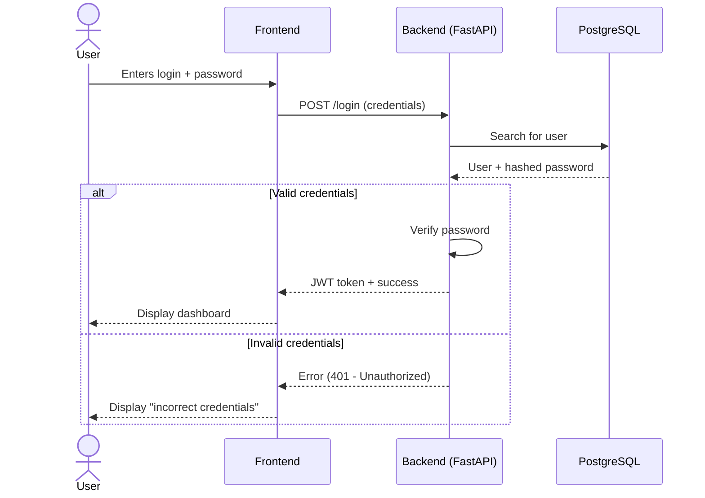

```mermaid
sequenceDiagram
    actor U as User
    participant F as Frontend
    participant B as Backend (FastAPI)
    participant DB as PostgreSQL
    U->>F: Enters login + password
    F->>B: POST /login (credentials)
    B->>DB: Search for user
    DB-->>B: User + hashed password

    alt Valid credentials
        B->>B: Verify password
        B-->>F: JWT token + success
        F-->>U: Display dashboard
    else Invalid credentials
        B-->>F: Error (401 - Unauthorized)
        F-->>U: Display "incorrect credentials"
    end
```