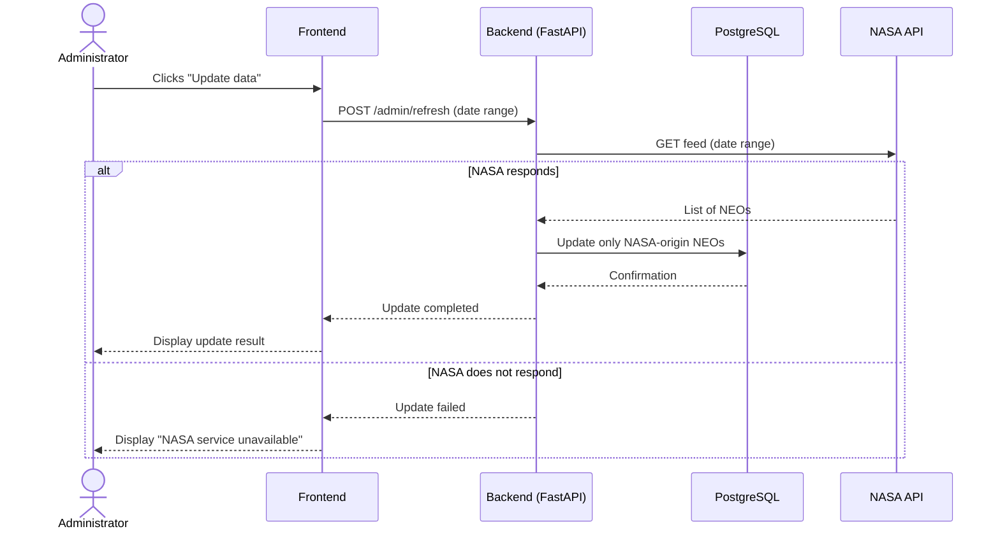

```mermaid
sequenceDiagram
    actor A as Administrator
    participant F as Frontend
    participant B as Backend (FastAPI)
    participant DB as PostgreSQL
    participant N as NASA API

    A->>F: Clicks "Update data"
    F->>B: POST /admin/refresh (date range)
    B->>N: GET feed (date range)

    alt NASA responds
        N-->>B: List of NEOs
        B->>DB: Update only NASA-origin NEOs
        DB-->>B: Confirmation
        B-->>F: Update completed
        F-->>A: Display update result
    else NASA does not respond
        B-->>F: Update failed
        F-->>A: Display "NASA service unavailable"
    end
```