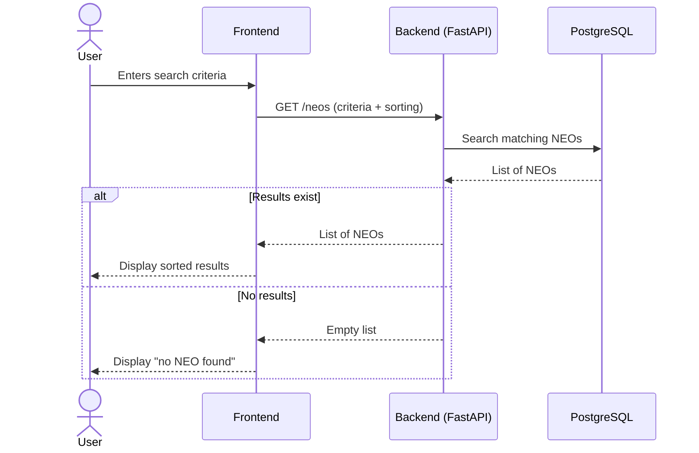

```mermaid
sequenceDiagram
    actor U as User
    participant F as Frontend
    participant B as Backend (FastAPI)
    participant DB as PostgreSQL

    U->>F: Enters search criteria
    F->>B: GET /neos (criteria + sorting)
    B->>DB: Search matching NEOs
    DB-->>B: List of NEOs

    alt Results exist
        B-->>F: List of NEOs
        F-->>U: Display sorted results
    else No results
        B-->>F: Empty list
        F-->>U: Display "no NEO found"
    end
```