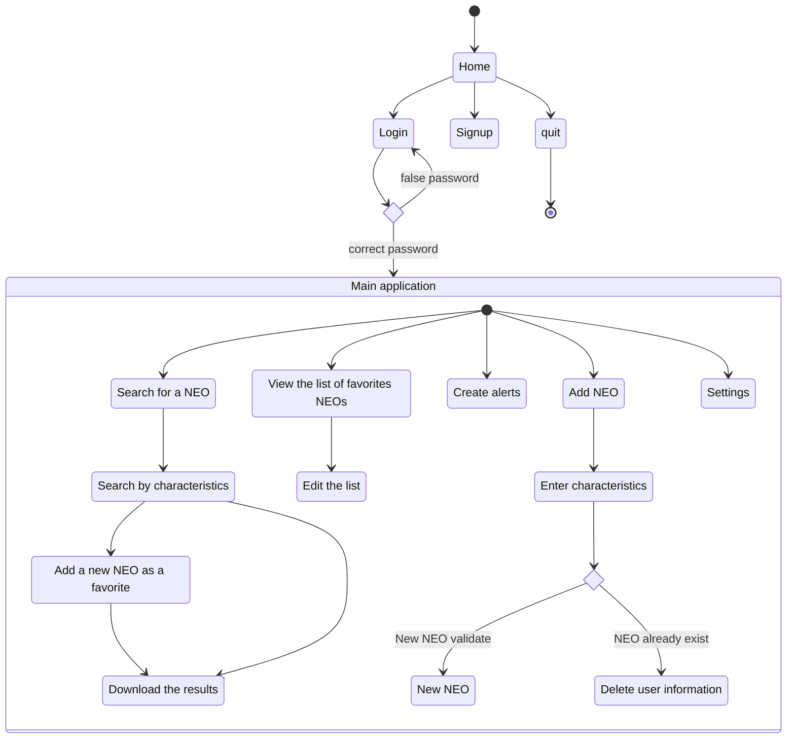

```mermaid
stateDiagram
  main_app:Main application
  search_neo:Search for a NEO
  search_characteristics:Search by characteristics
  download:Download the results
  add_favorites:Add a new NEO as a favorite
  favs_list:View the list of favorites NEOs
  edit_list:Edit the list
  add_neo:Add NEO
  enter_characteristics:Enter characteristics
  New_neo:New NEO
  Delete_user_info:Delete user information
  create_alerts:Create alerts
  settings:Settings
  login:Login
  signup:Signup

  state if_state <<choice>>
  state if_statemain <<choice>>

  [*] --> Home
  Home --> quit
  quit --> [*]
  Home --> signup
  Home --> login
  login --> if_state
  if_state --> main_app:correct password
  if_state --> login:false password

  state main_app {
    [*] --> search_neo
    search_neo --> search_characteristics
    search_characteristics --> add_favorites
    add_favorites --> download
    search_characteristics --> download
    [*] --> favs_list
    favs_list --> edit_list
    [*] --> create_alerts
    [*] --> add_neo
    add_neo --> enter_characteristics
    enter_characteristics --> if_statemain
    if_statemain --> New_neo:New NEO validate
    if_statemain --> Delete_user_info:NEO already exist
    [*] --> settings

  }
```