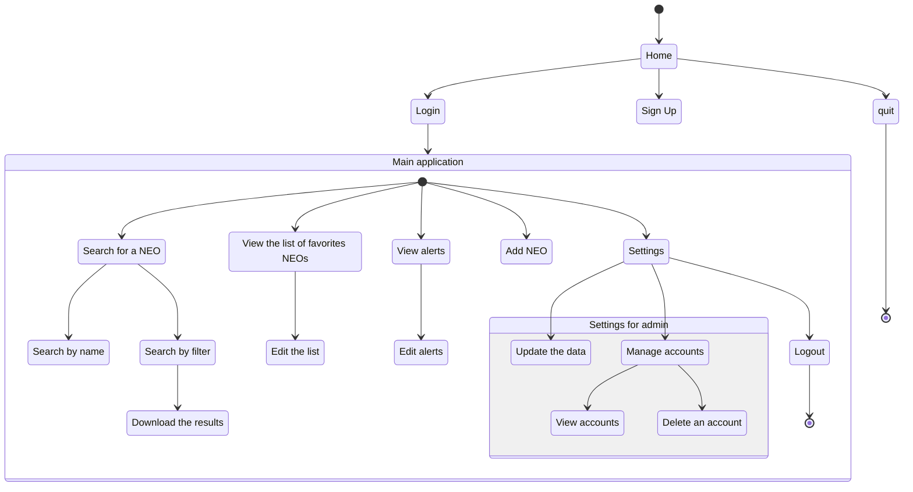

```mermaid
stateDiagram
    login : Login
    main_app : Main application
    signup : Sign Up
    search_neo : Search for a NEO
    favs_list : View the list of favorites NEOs
    settings : Settings
    search_name : Search by name
    search_filter : Search by filter
    download : Download the results
    edit_list : Edit the list
    update_data : Update the data
    manage_accounts : Manage accounts
    alerts : View alerts
    edit_alerts : Edit alerts
    add_neo : Add NEO
    view_accounts : View accounts
    delete_accounts : Delete an account
    logout : Logout
    settings_admin : Settings for admin

    [*] --> Home
    Home --> login
    login --> main_app
    Home --> signup
    Home --> quit
    quit --> [*]

    state main_app {
        [*] --> search_neo
        search_neo --> search_name
        search_neo --> search_filter
        search_filter --> download
        [*] --> favs_list
        favs_list --> edit_list
        [*] --> alerts
        alerts --> edit_alerts
        [*] --> add_neo
        [*] --> settings
        state settings_admin {
            settings --> update_data
            settings --> manage_accounts
            manage_accounts --> view_accounts
            manage_accounts --> delete_accounts
        }
        settings --> logout
        logout --> [*]
    }
```