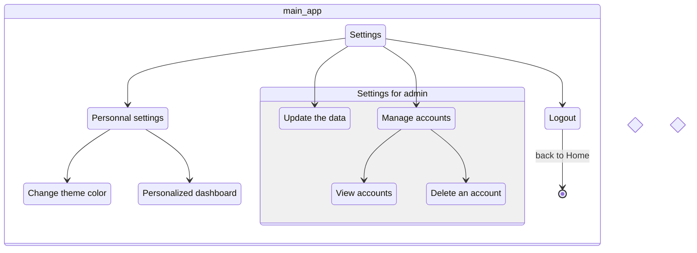

```mermaid
stateDiagram
  
  settings:Settings
  logout:Logout
  settings_admin:Settings for admin
  manage_accounts:Manage accounts
  view_accounts:View accounts
  delete_accounts:Delete an account
  update_data:Update the data
  personnal_settings: Personnal settings
  change_theme_colors: Change theme color
  change_dashbord_organization: Personalized dashboard

  state if_state <<choice>>
  state if_statemain <<choice>>


  state main_app {
    settings --> personnal_settings
    personnal_settings --> change_theme_colors
    personnal_settings --> change_dashbord_organization

    settings --> logout
    settings --> update_data
    settings --> manage_accounts
    logout --> [*]:back to Home
    state settings_admin {
      manage_accounts --> view_accounts
      manage_accounts --> delete_accounts
      update_data
    }
  }
```