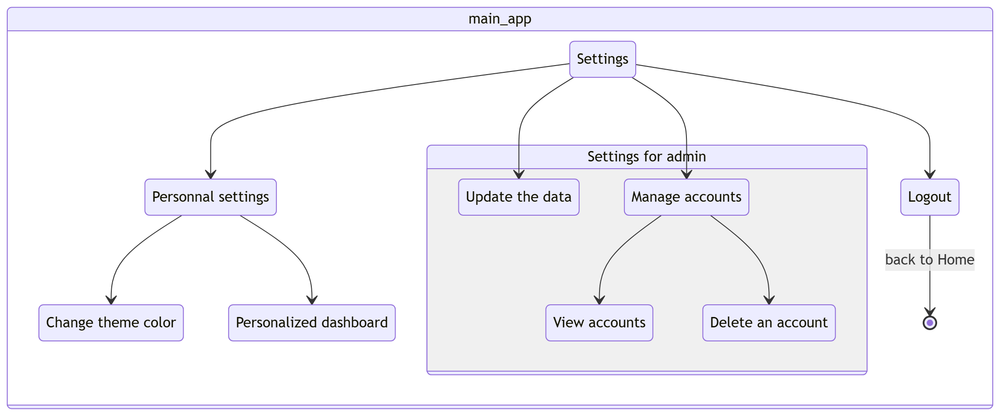
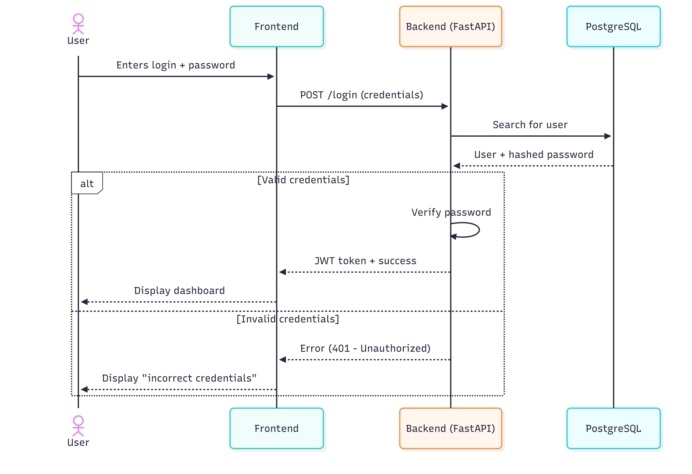
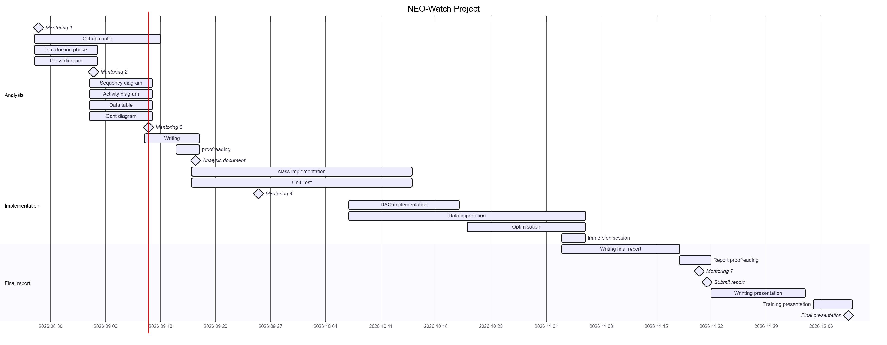

\begin{titlepage}
\centering

{\LARGE\textsc{Informatic project}}\\
\vspace{0.5cm}
{\large Studient 2nd year}

\vspace{2.5cm}

\rule{\textwidth}{0.5mm}\\
\vspace{0.8cm}
{\huge\bfseries Analysis report: NEO-Watch}\\
\vspace{0.8cm}
\rule{\textwidth}{0.5mm}\\

\vspace{2.5cm}

\begin{flushleft}
\emph{Students :}\\
Yann Malzieu\\
Faustine Barbeau\\
Jules Frulli\\
Abderrahmane Taleb Amar\\
\end{flushleft}

\begin{flushright}
\emph{Tutor :}\\
Olivier Ricciardi\\
\vspace{1.0cm}
\end{flushright}

\vfill 
\begin{center}
ENSAI\\
2026--2027
\end{center}
\end{titlepage}

\renewcommand{\contentsname}{Table of content}
\tableofcontents

# 1. Introduction and Context - A 

# 2. Requirements Analysis and Main Features

## 2.1. Functional Requirements (User Management, Dashboard, Alerts, NASA API). - A

## 2.2. Application Features (Use Case Diagram). - F

## 2.3. Application Workflow (Activity Diagram + Settings Activity Diagram). - Y

When the user is logging, he enter in the main application. We list all the features and also the settings part as show as in figure 3.

This figure focuses on the settings section. There are two different parts: one for the user and the other for the administrator. The administrator is also a user, so they can access both parts.

Users has a personal section where they can change the theme color, such as switching to dark mode or light mode.

They can also customize the dashboard, meaning they can choose which features they want to display on the dashboard page.

The administrator can use these features in their designated section. 

Additionally, when a user logs out, the application automatically redirects them to the home page.

# 3. Technical Design and Data Structure

### In introduction put here the technical characteristics - Y 

The application will be developed in Python and version-controlled via Git, to run a FastAPI backend coupled with a PostgreSQL database for reliable data persistence. It will dynamically integrate with NASA’s Near Earth Object Web Service (NeoWs) REST API using secure authentication keys. Code quality and system reliability will be ensured by comprehensive automated testing with pytest, while the frontend layer will be flexibly built using Python frameworks or standard web technologies.

## 3.1. Class Architecture (Class Diagram). - J

## 3.2. Table Organization (Database Diagram). - J 

# 4. Modeling the Application's Layered Structure

## 4.1. Authentication and Role Management (Login Sequence Diagram) - Y

In the application's architecture, we implement several features, the first one is illustrated with a sequence diagram for the login process.

The diagram involves four layers: the user, the frontend, the backend, and the PostgreSQL database.

Users enter their login credentials on the frontend page, which triggers a POST request sent to the backend. The backend queries the PostgreSQL database to search for the user, and the database returns the user record along with the hashed password. The backend then verifies the password. If the credentials are valid, the backend issues a JWT token and a success response, allowing the user to access the dashboard. Otherwise, the backend returns an error, and an incorrect credentials message is displayed to the user.

## 4.2. NEO Search Management (Search NEO Sequence Diagram) - A

## 4.3. Synchronization with the NASA API (Database Update Sequence Diagram) - A

# 5. User Interface (Menu Diagram) - F

# 6. Project Management and Planning (Gantt Chart) - Y

We have not yet assigned specific roles or functions within the team. Since we are a group of four and currently communicate very well, we haven't felt the need to formalize them yet. However, we may define specific responsibilities once we reach the coding phase.

The Gantt diagram above illustrates how we plan to organize our workflow moving forward, as well as how we coordinated the writing of the analysis document. Due to the significant time gap between Mentoring 4 and the immersion session, our exact schedule is subject to minor adjustments as the project progresses.

# 7. Conclusion and Perspectives

# Annexe

