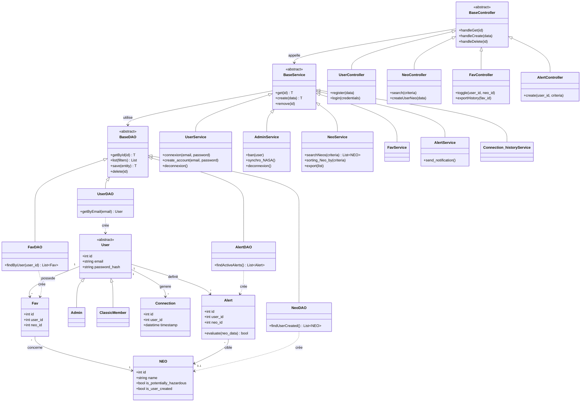

```mermaid
classDiagram
    class BaseDAO{
        <<abstract>>
        +getById(id) T
        +list(filters) List
        +save(entity) T
        +delete(id)
    }
    class BaseService{
        <<abstract>>
        +get(id) T
        +create(data) T
        +remove(id)
    }
    class BaseController{
        <<abstract>>
        +handleGet(id)
        +handleCreate(data)
        +handleDelete(id)
    }
    BaseController--> BaseService: appelle
    BaseService--> BaseDAO: utilise

    class UserDAO {
        +getByEmail(email) User
    }
    class UserService {
        +connexion(email, password)
        +create_account(email, password)
        +deconnexion()
    }
    class AdminService {
        +ban(user)
        +synchro_NASA()
        +deconnexion()
    }
    class UserController {
        +register(data)
        +login(credentials)
    }
    BaseDAO<|-- UserDAO
    BaseService<|-- UserService
    BaseService<|-- AdminService
    BaseController<|-- UserController

    class NeoDAO {
        +findUserCreated() List~NEO~
    }
    class NeoService {
        +searchNeos(criteria) List~NEO~
        +sorting_Neo_by(criteria)
        +export(list)
    }
    class NeoController {
        +search(criteria)
        +createUserNeo(data)
    }
    BaseDAO<|-- NeoDAO
    BaseService<|-- NeoService
    BaseController<|-- NeoController

    class FavDAO {
        +findByUser(user_id) List~Fav~
    }
    class FavService {
    }
    class FavController {
        +toggle(user_id, neo_id)
        +exportHistory(fav_id)
    }
    BaseDAO<|-- FavDAO
    BaseService<|-- FavService
    BaseController<|-- FavController

    class AlertDAO {
        +findActiveAlerts() List~Alert~
    }
    class AlertService {
        +send_notification()
    }
    class AlertController {
        +create(user_id, criteria)
    }
    BaseDAO<|-- AlertDAO
    BaseService<|-- AlertService
    BaseController<|-- AlertController

    class Connection_historyService{
    }
    BaseService<|-- Connection_historyService

    class User {
        <<abstract>>
        +int id
        +string email
        +string password_hash
    }
    class Admin {
    }
    class ClassicMember {
    }
    class Connection {
        +int id
        +int user_id
        +datetime timestamp
    }
    class NEO {
        +int id
        +string name
        +bool is_potentially_hazardous
        +bool is_user_created
    }
    class Fav {
        +int id
        +int user_id
        +int neo_id
    }
    class Alert {
        +int id
        +int user_id
        +int neo_id
        +evaluate(neo_data) bool
    }

    User <|-- Admin
    User <|-- ClassicMember
    User "1" --> "*" Connection : genere
    User "1" --> "*" Fav : possede
    User "1" --> "*" Alert : definit
    Fav "*" --> "1" NEO : concerne
    Alert "*" --> "0..1" NEO : cible

    UserDAO ..> User : crée
    NeoDAO ..> NEO : crée
    FavDAO ..> Fav : crée
    AlertDAO ..> Alert : crée
```