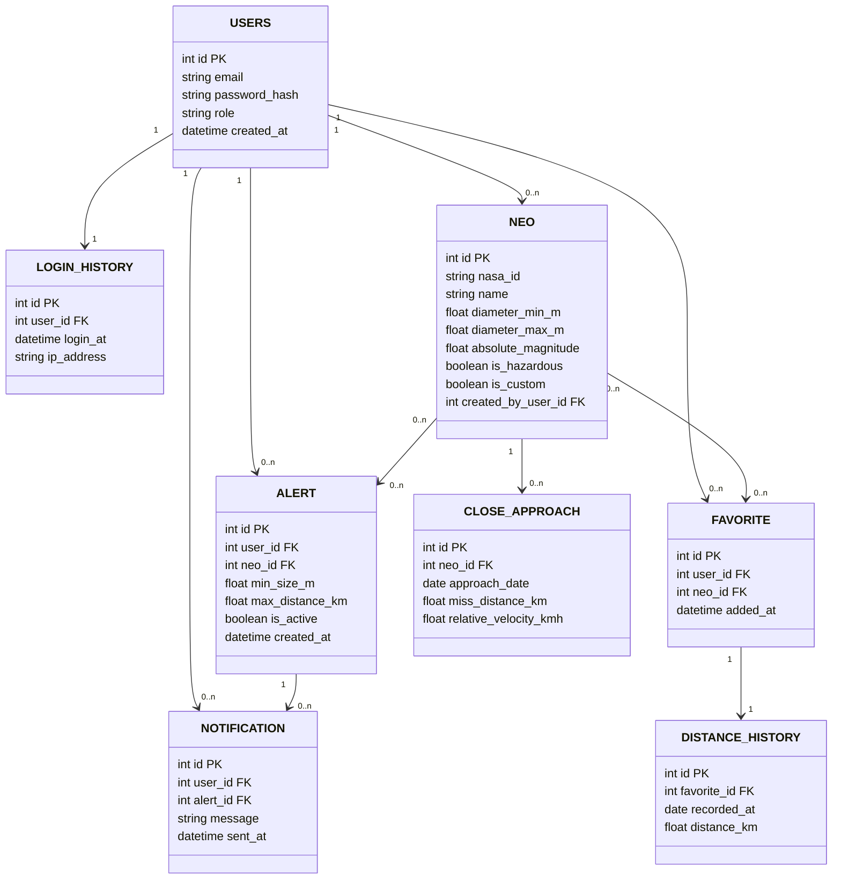

```mermaid
classDiagram
    USERS "1" --> "0..n" ALERT 
    USERS "1" --> "1" LOGIN_HISTORY 
    USERS "1" --> "0..n" NEO 
    USERS "1" --> "0..n" FAVORITE
    USERS "1" --> "0..n" NOTIFICATION
    NEO "1" --> "0..n" CLOSE_APPROACH
    NEO "0..n" --> "0..n" FAVORITE
    NEO "0..n" --> "0..n" ALERT
    FAVORITE "1" --> "1" DISTANCE_HISTORY
    ALERT "1" --> "0..n" NOTIFICATION

    class USERS {
        int id PK
        string email
        string password_hash
        string role
        datetime created_at
    }
    class LOGIN_HISTORY {
        int id PK
        int user_id FK
        datetime login_at
        string ip_address
    }
    class NEO {
        int id PK
        string nasa_id
        string name
        float diameter_min_m
        float diameter_max_m
        float absolute_magnitude
        boolean is_hazardous
        boolean is_custom
        int created_by_user_id FK
    }
    class CLOSE_APPROACH {
        int id PK
        int neo_id FK
        date approach_date
        float miss_distance_km
        float relative_velocity_kmh
    }
    class FAVORITE {
        int id PK
        int user_id FK
        int neo_id FK
        datetime added_at
    }
    class DISTANCE_HISTORY {
        int id PK
        int favorite_id FK
        date recorded_at
        float distance_km
    }
    class ALERT {
        int id PK
        int user_id FK
        int neo_id FK
        float min_size_m
        float max_distance_km
        boolean is_active
        datetime created_at
    }
    class NOTIFICATION {
        int id PK
        int user_id FK
        int alert_id FK
        string message
        datetime sent_at
    }
```