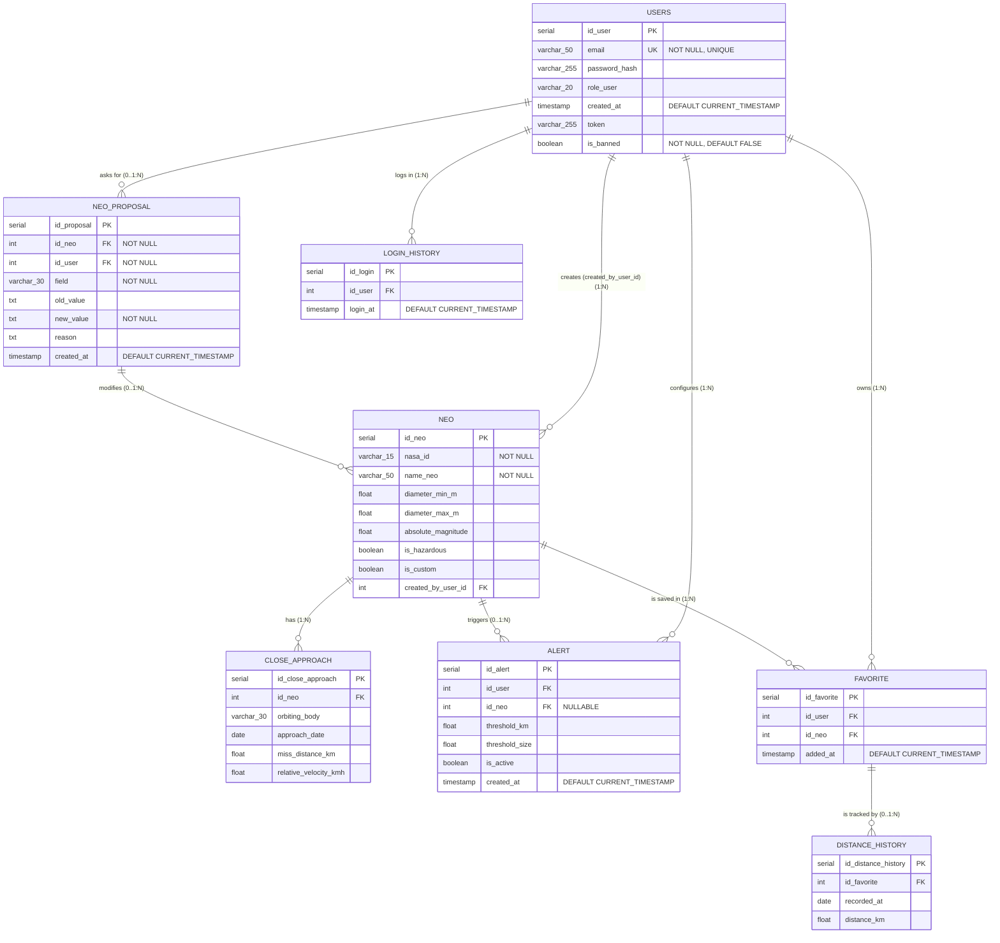

```mermaid
erDiagram
    USERS {
        serial id_user PK
        varchar_50 email UK "NOT NULL, UNIQUE"
        varchar_255 password_hash
        varchar_20 role_user
        timestamp created_at "DEFAULT CURRENT_TIMESTAMP"
        varchar_255 token
        boolean is_banned "NOT NULL, DEFAULT FALSE"
    }

    NEO {
        serial id_neo PK
        varchar_15 nasa_id "NOT NULL"
        varchar_50 name_neo "NOT NULL"
        float diameter_min_m
        float diameter_max_m
        float absolute_magnitude
        boolean is_hazardous
        boolean is_custom
        int created_by_user_id FK
    }

    NEO_PROPOSAL {
        serial id_proposal PK
        int id_neo FK "NOT NULL"
        int id_user FK "NOT NULL"
        varchar_30 field "NOT NULL"
        txt old_value
        txt new_value "NOT NULL"
        txt reason
        timestamp created_at "DEFAULT CURRENT_TIMESTAMP"
    }

    CLOSE_APPROACH {
        serial id_close_approach PK
        int id_neo FK
        varchar_30 orbiting_body
        date approach_date
        float miss_distance_km
        float relative_velocity_kmh
    }

    LOGIN_HISTORY {
        serial id_login PK
        int id_user FK
        timestamp login_at "DEFAULT CURRENT_TIMESTAMP"
    }

    ALERT {
        serial id_alert PK
        int id_user FK
        int id_neo FK "NULLABLE"
        float threshold_km
        float threshold_size
        boolean is_active
        timestamp created_at "DEFAULT CURRENT_TIMESTAMP"
    }

    FAVORITE {
        serial id_favorite PK
        int id_user FK
        int id_neo FK
        timestamp added_at "DEFAULT CURRENT_TIMESTAMP"
    }

    DISTANCE_HISTORY {
        serial id_distance_history PK
        int id_favorite FK
        date recorded_at
        float distance_km
    }


    USERS ||--o{ NEO : "creates (created_by_user_id) (1:N)"
    USERS ||--o{ LOGIN_HISTORY : "logs in (1:N)"
    USERS ||--o{ ALERT : "configures (1:N)"
    USERS ||--o{ FAVORITE : "owns (1:N)"
    NEO ||--o{ CLOSE_APPROACH : "has (1:N)"
    NEO ||--o{ ALERT : "triggers (0..1:N)"
    NEO ||--o{ FAVORITE : "is saved in (1:N)"
    FAVORITE ||--o{ DISTANCE_HISTORY : "is tracked by (0..1:N)"
    NEO_PROPOSAL ||--o{ NEO : "modifies (0..1:N)"
    USERS ||--o{ NEO_PROPOSAL : "asks for (0..1:N)"
```
