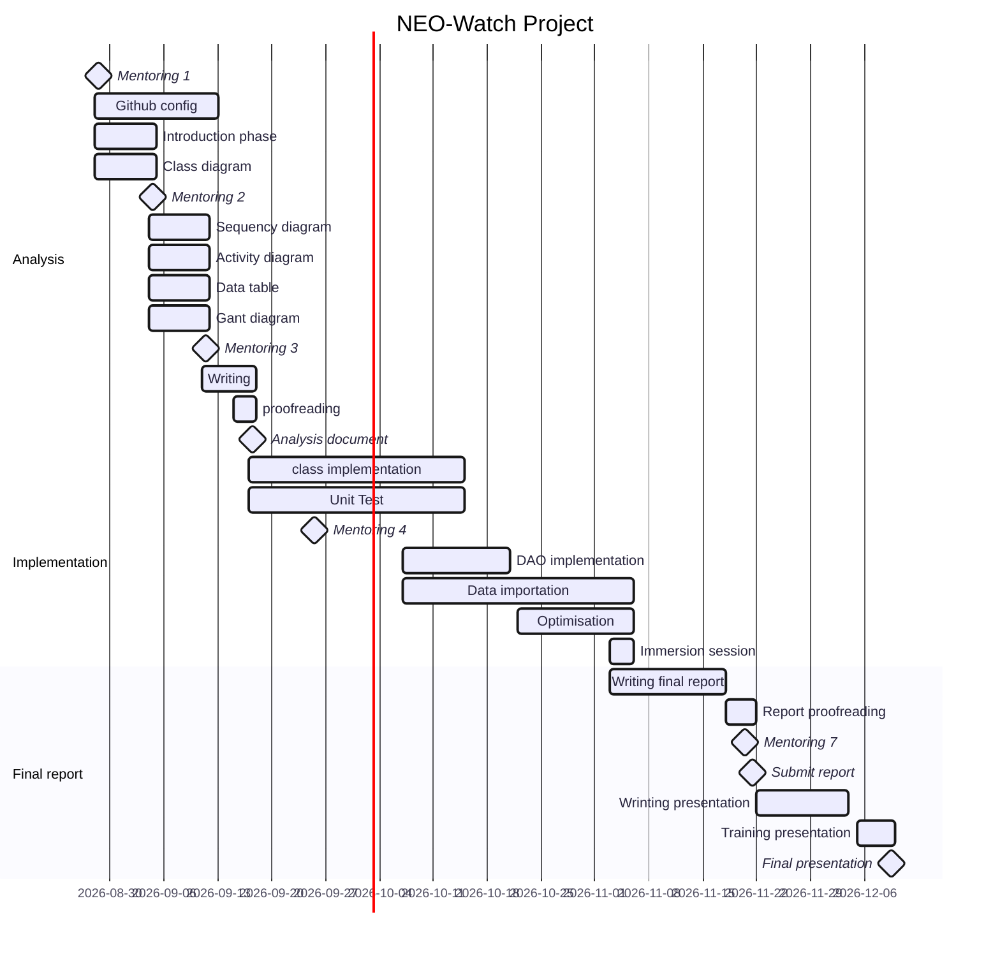

```mermaid
---
config:
  theme: redux
---
gantt
    title NEO-Watch Project
    dateFormat YYYY-MM-DD
    section Analysis
        Mentoring 1        :milestone, 2026-08-28, 1d
        Github config      :2026-08-28, 16d
        Introduction phase :2026-08-28, 8d
        Class diagram      :2026-08-28, 8d
        Mentoring 2        :milestone, 2026-09-04, 1d
        Sequency diagram   :2026-09-04, 8d
        Activity diagram   :2026-09-04, 8d
        Data table         :2026-09-04, 8d
        Gant diagram      :2026-09-04, 8d
        Mentoring 3        :milestone, 2026-09-11, 1d
        Writing            :2026-09-11, 7d
        proofreading       :2026-09-15, 3d
        Analysis document  :milestone, 2026-09-17, 1d
    section Implementation
        class implementation: 2026-09-17, 28d
        Unit Test          :2026-09-17, 28d
        Mentoring 4        :milestone, 2026-09-25, 1d
        DAO implementation :2026-10-07, 14d
        Data importation   :2026-10-07, 30d
        Optimisation       :2026-10-22, 15d
        Immersion session  :2026-11-03, 3d
    section Final report
        Writing final report :2026-11-03, 15d
        Report proofreading  :2026-11-18, 4d
        Mentoring 7        :milestone, 2026-11-20, 1d
        Submit report   :milestone, 2026-11-21, 1d
        Wrinting presentation :2026-11-22, 12d
        Training presentation :2026-12-05, 5d
        Final presentation :milestone, 2026-12-09, 1d
```
