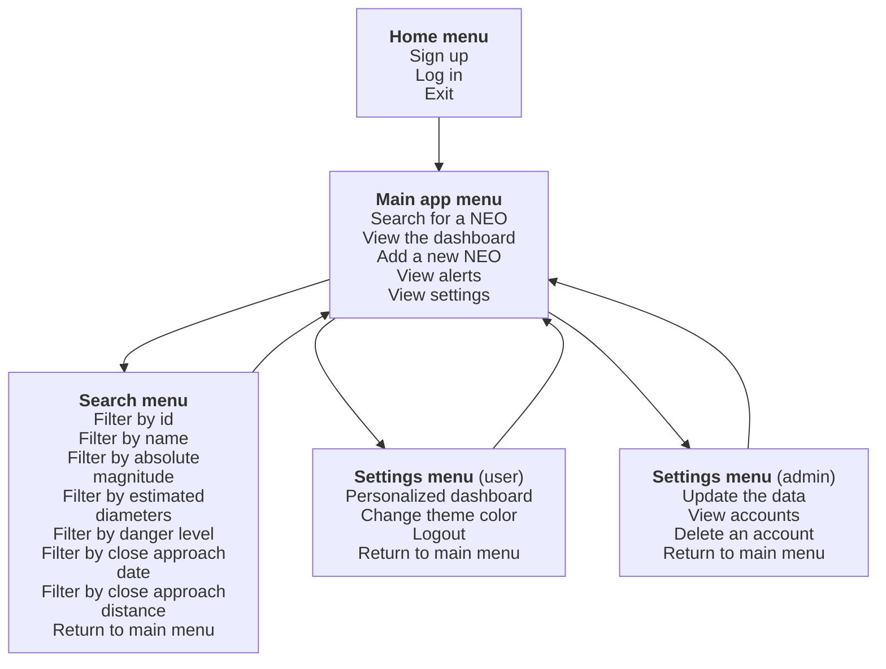

```mermaid
---
config:
      htmlLabels : false
---
flowchart TD
      home_menu["`**Home menu**
      Sign up
      Log in
      Exit`"]

      home_menu --> main_app 
     
      main_app["`**Main app menu**
      Search for a NEO
      View the dashboard
      Add a new NEO
      View alerts
      View settings`"]

      main_app --> search_menu

      search_menu["`**Search menu**
      Filter by id
      Filter by name
      Filter by absolute magnitude
      Filter by estimated diameters
      Filter by danger level
      Filter by close approach date
      Filter by close approach distance 
      Return to main menu`"]

      search_menu --> main_app

      settings_user["`**Settings menu** (user)
      Personalized dashboard
      Change theme color
      Logout
      Return to main menu`"]

      main_app --> settings_user
      settings_user --> main_app

      settings_admin["`**Settings menu** (admin)
      Update the data
      View accounts
      Delete an account
      Return to main menu`"]

      main_app --> settings_admin
      settings_admin --> main_app

```
