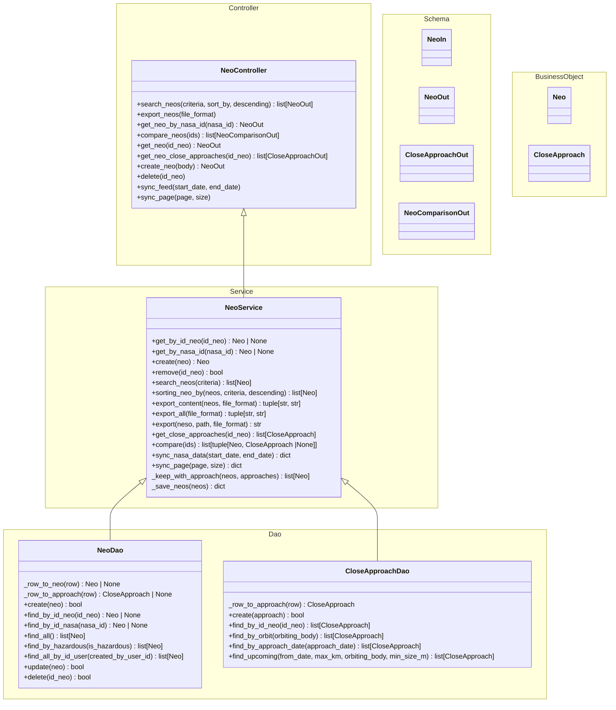

```mermaid
classDiagram
  namespace Controller {
  class NeoController {
          +search_neos(criteria, sort_by, descending) list[NeoOut]
          +export_neos(file_format)
          +get_neo_by_nasa_id(nasa_id) NeoOut
          +compare_neos(ids) list[NeoComparisonOut]
          +get_neo(id_neo) NeoOut
          +get_neo_close_approaches(id_neo) list[CloseApproachOut]
          +create_neo(body) NeoOut
          +delete(id_neo)
          +sync_feed(start_date, end_date)
          +sync_page(page, size)
  }}
  
  namespace Schema {
    class NeoIn {
    }

    class NeoOut {
    }

    class CloseApproachOut {
    }

    class NeoComparisonOut {
    }}

  namespace Service {
  class NeoService {
        +get_by_id_neo(id_neo) Neo | None
        +get_by_nasa_id(nasa_id) Neo | None
        +create(neo) Neo
        +remove(id_neo) bool
        +search_neos(criteria) list[Neo]
        +sorting_neo_by(neos, criteria, descending) list[Neo]
        +export_content(neos, file_format) tuple[str, str]
        +export_all(file_format) tuple[str, str]
        +export(neso, path, file_format) str
        +get_close_approaches(id_neo) list[CloseApproach]
        +compare(ids) list[tuple[Neo, CloseApproach |None]]
        +sync_nasa_data(start_date, end_date) dict
        +sync_page(page, size) dict
        _keep_with_approach(neos, approaches) list[Neo]
        _save_neos(neos) dict
  }}

  namespace Dao {
    class NeoDao {
        _row_to_neo(row) Neo | None
        _row_to_approach(row) CloseApproach | None
        +create(neo) bool
        +find_by_id_neo(id_neo) Neo | None
        +find_by_id_nasa(nasa_id) Neo | None
        +find_all() list[Neo]
        +find_by_hazardous(is_hazardous) list[Neo]
        +find_all_by_id_user(created_by_user_id) list[Neo]
        +update(neo) bool
        +delete(id_neo) bool
    }

    class CloseApproachDao {
        _row_to_approach(row) CloseApproach
        +create(approach) bool
        +find_by_id_neo(id_neo) list[CloseApproach]
        +find_by_orbit(orbiting_body) list[CloseApproach]
        +find_by_approach_date(approach_date) list[CloseApproach]
        +find_upcoming(from_date, max_km, orbiting_body, min_size_m) list[CloseApproach]
    }}

  namespace BusinessObject {
    class Neo {
    }
    class CloseApproach {
    }}


  NeoController <|-- NeoService
  NeoService <|-- NeoDao
  NeoService <|-- CloseApproachDao
```
