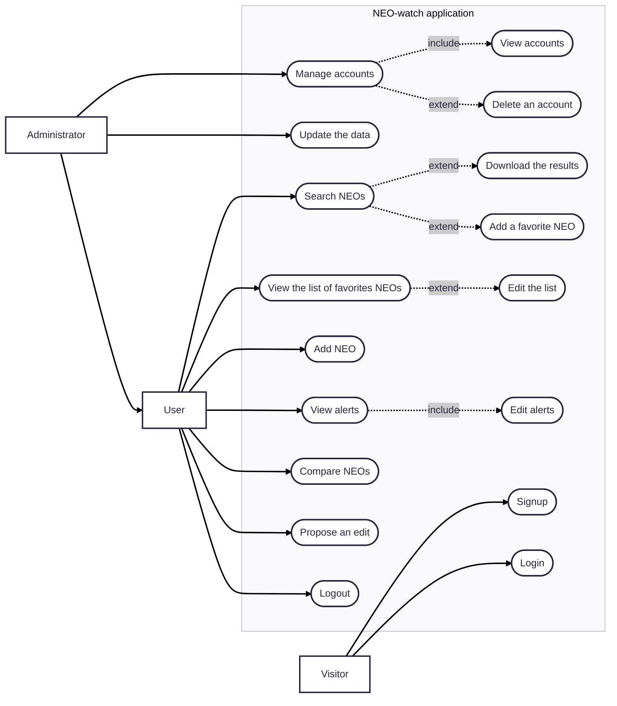

```mermaid
---
config:
  theme: redux
---
flowchart LR
    Visitor["Visitor"]
    User["User"]
    Admin["Administrator"]

    subgraph subgroup["NEO-watch application"]
        logout([Logout])
        search([Search NEOs])
        download([Download the results])
        favlist([View the list of favorites NEOs])
        addfav([Add a favorite NEO])
        editlist([Edit the list])
        alerts([View alerts])
        editalerts([Edit alerts])
        add([Add NEO])
        update([Update the data])
        manage([Manage accounts])
        accounts([View accounts])
        deleteaccount([Delete an account])
        login([Login])
        signup([Signup])
        compareneos([Compare NEOs])
        propose([Propose an edit])
        
    end

    
    User --> search
    User --> favlist
    User --> add
    User --> alerts
    User --> compareneos
    User --> propose
    User --> logout
    Admin --> manage
    Admin --> update
    Admin --> User

    Visitor --> signup
    Visitor --> login

    alerts -. "include" .-> editalerts
    manage -. "include" .-> accounts
    search -. "extend" .-> download
    search -. "extend" .-> addfav
    favlist -. "extend" .-> editlist
    manage -. "extend" .-> deleteaccount
```
