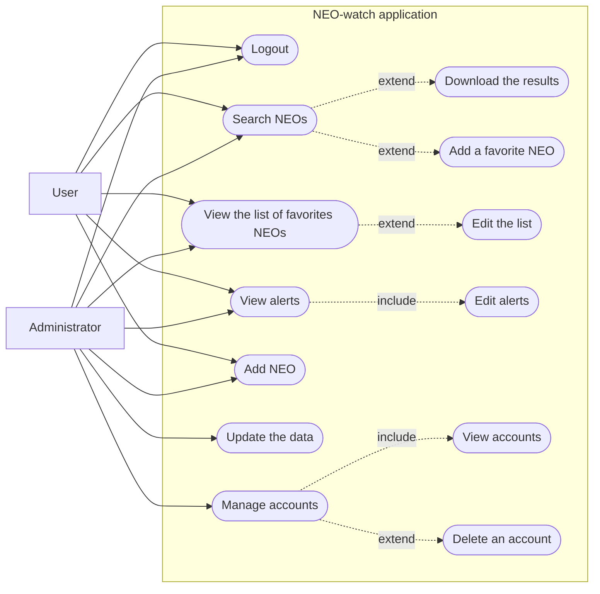

```mermaid
---
config:
  layout: fixed
---
flowchart LR
 subgraph subgroup["NEO-watch application"]
        logout(["Logout"])
        search(["Search NEOs"])
        download(["Download the results"])
        favlist(["View the list of favorites NEOs"])
        addfav(["Add a favorite NEO"])
        editlist(["Edit the list"])
        alerts(["View alerts"])
        editalerts(["Edit alerts"])
        add(["Add NEO"])
        update(["Update the data"])
        manage(["Manage accounts"])
        accounts(["View accounts"])
        deleteaccount(["Delete an account"])
  end
    User["User"] --> search & favlist & add & alerts & logout
    Admin["Administrator"] --> manage & update & search & favlist & add & alerts & logout
    alerts -. include .-> editalerts
    manage -. include .-> accounts
    search -. extend .-> download & addfav
    favlist -. extend .-> editlist
    manage -. extend .-> deleteaccount
```
